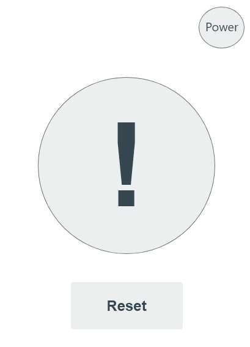
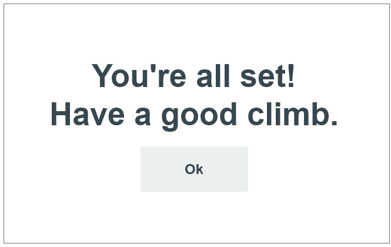

# Phase 2: Interaction Design

Michael Price, Ian McDonald

## Wireframe Artboards

  

The welcome page was designed to be as learnable and effective as possible with the main buttons featured prominently. According to our scenarios with certain personas who were new to climbing, it was originally hard to figure out what a newcomer would do. Accordingly, we tried to make it as apparent as possible. 
For our regular climber personas, we tried to make it simple for them to find themselves to check in by adding images next to the results and the option to type in either their name or ID. 
For staff, we made the orientation button fairly difficult to find so that no one else would accidentally press it as some of our personas were not too tech savvy and may be prone to accidents.

  

The staff pager only has one job: to alert a staff member of when someone requires assistance. As such, the design is simple with only two buttons for power and to reset it.

  

Since no one but the staff interacts with the orientation video page, we tried to keep it very simple so none of our less tech savvy personas would accidentally press anything. 

  

Like most of our design, we attempted to make it as simple, efficient and error tolerant as possible for the users and gave them only two easy choices. 

  
  

Both screens are meant to be simple while being as effective as possible at conveying what is happening. The final screen was also designed to be a bit satisfying.
